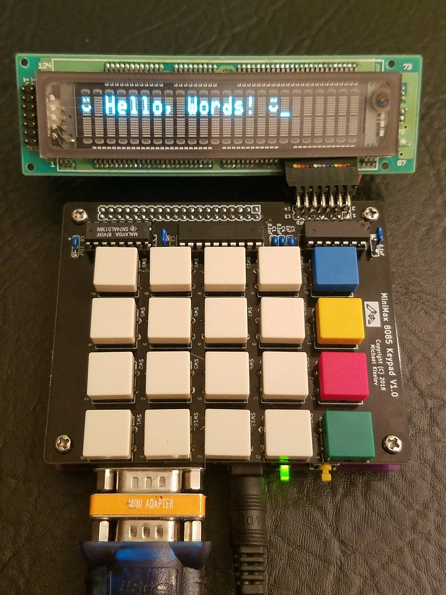

# minimax8085-keypad-vfd
Keypad and VFD (vacuum fluorescent display) extension board for the MiniMax 8085 SBC

## Introduction

The Keypad and VFD extension board provides simple 20-key keypad and display for [MiniMax8085 SBC](https://github.com/skiselev/minimax8085).
It is designed to be plugged on the top of MiniMax8085 using 2x20 pin header / pin socket.

## Hardware Documentation

### Schematic and PCB Layout

[Schematic - Version 1.0](KiCad/MiniMax8085-Keypad-VFD-Schematic-1.0.pdf)

[PCB Layout - Version 1.0](KiCad/MiniMax8085-Keypad-VFD-Board-1.0.pdf)

### Design Description

#### Address Decode / Chip Select

The Keypad and VFD extension board uses 74HCT138 3-to-8 decoder and 74HCT32 quad 2-input OR gate ICs for address decode:
* Enable signal G1 of 74HCT138 is connected to IO/M signal, and therefore the decoder is enabled only during I/O operations, when IO/M signal value is HIGH
* Enable signals /G2A and /G2B of 74HCT138 are connected to address lines A6 and A7, so that decoder is enabled when both of these signals are low - 0x00 - 0x3F address range
* Inputs A-C of 74HCT138 are connected to address lines A3 - A4, therefore each output of 74HCT138 is active (LOW) for a block of 8 consequitive I/O addresses, /Y0 - for 0x00-0x07, /Y1 - for 0x08-0x0F, ... , /Y6 for 0x30-0x37, and /Y6 for 0x38-0x3F
* Output /Y6 of 74HCT138 is connected to the input of the OR gate U3C, another input of that gate is connected to /RD signal. As the result, the output of the gate U3C - /KPD_RD is active (LOW) during read cycles from 0x30-0x37 I/O range. /KPD_RD is used as the read signal for the keypad encoder
* Output /Y7 of 74HCT138 is connected to inputs of the OR gate U3A and U3B. The second input of the OR gate U3B is connected to /RD signal, so that the output of U3B - /VFD_RD is active (LOW) during read cycles from 0x38-0x3F I/O range. /VFD_RD is used as the read signal for the VFD module. The second input of the OR gate U3A is connected to /WR signal, so that the output of U3A - /VFD_WR is active (LOW) during write cycles to 0x38-0x3F I/O range. /VFD_WR is used as the write signal for the VFD module

#### VFD Interface

The board is designed to interface to a [Noritake CU24025-UW1J](https://www.noritake-elec.com/products/model?part=CU24025-UW1J) or similar VFD module, that is configured in Intel 8000 mode (using a solder link on the module), and the interface is staright-forward:
* Data lines DB0-DB7 of the VFD modules are connected to AD0-AD7 signals
* Register select input RS of the VFD module is connected to address line A0, therefore writing to even addresses in 0x38-0x3F range, writes the command register, while writing or reading odd addresses goes to DDRAM (display memory) or CGRAM (character generator memory)
* /RD and /WR inputs of the VFD module are connected to /VFD_RD and /VFD_WR signals respectfully

#### Keypad Interface

The Keypad and VFD extension board uses [74C923](doc/Fairchild-MM74C922-MM74C923-Datasheet.pdf) 20-key encoder for scanning the keypad. When this IC detects that a keypad button has been pressed, it activates D_AVAIL output, connected to the RST7_5 interrupt signal, resulting in an interrupt to the 8085 CPU. The interrupt service routine can then read the keypad button code from I/O ports in range 0x30-0x37. Only AD0-AD5 data lines are used, therefore the 0x1F AND mask should be applied by the interrupt service routine to the value read from the port.

### Bill of Materials

#### Version 1.0

[MiniMax8085 Keypad and VFD project on Mouser.com](https://www.mouser.com/ProjectManager/ProjectDetail.aspx?AccessID=7fc9d2ae6d) - View and order all components except of the PCB, the VFD module, and the 74C923 20-key encoder.

[MiniMax8085 Keypad and VFD project on OSH Park](https://oshpark.com/shared_projects/jRaDS2Pu) - View and order the PCB.

Component type     | Reference  | Description                                 | Quantity | Possible sources and notes 
------------------ | ---------- | ------------------------------------------- | -------- | --------------------------
PCB                |            | MiniMax 8085 VFD & Keypad PCB               | 1        | Order from a PCB manufacturer of your choice using provided Gerber or KiCad files
Integrated Circut  | U1         | 74C923 20-key encoder, DIP-20               | 1        | eBay
Integrated Circut  | U2         | 74HCT138 3-to-8 line decoder, DIP-16        | 1        | Mouser [595-SN74HCT138N](https://www.mouser.com/ProductDetail/595-SN74HCT138N) Note: Possible replacements: 74LS138, 74HC138, 74ALS138
Integrated Circut  | U3         | 74HCT32 quad 2-input OR gate, DIP-14        | 1        | Mouser [595-SN74HCT32N](https://www.mouser.com/ProductDetail/595-SN74HCT32N) Note: Possible replacements: 74LS32, 74HC32, 74ALS32
IC Socket          | U1         | DIP-20, 300 mil socket                      | 1        | Mouser [517-4820-3000-CP](https://www.mouser.com/ProductDetail/517-4820-3000-CP)
IC Socket          | U2         | DIP-16, 300 mil socket                      | 1        | Mouser [517-4816-3000-CP](https://www.mouser.com/ProductDetail/517-4816-3000-CP)
IC Socket          | U3         | DIP-14, 300 mil socket                      | 1        | Mouser [517-4814-3000-CP](https://www.mouser.com/ProductDetail/517-4814-3000-CP)
Tactile Switch     | SW1 - SW20 | 12x12mm tactile switch, projected type (Omron B3F-4050, Omron B3F-5050) | 20       | Mouser [653-B3F-4050](https://www.mouser.com/ProductDetail/653-B3F-4050), [653-B3F-5050](https://www.mouser.com/ProductDetail/653-B3F-5050)
Switch Key Tops    | SW1 - SW16 | 12x12mm keycap, gray (Omron B32-1300)       | 16       | Mouser [653-B32-1300](https://www.mouser.com/ProductDetail/653-B32-1300)
Switch Key Tops    | SW17       | 12x12mm keycap, blue (Omron B32-1340)       | 1        | Mouser [653-B32-1340](https://www.mouser.com/ProductDetail/653-B32-1340)
Switch Key Tops    | SW18       | 12x12mm keycap, yellow (Omron B32-1330)     | 1        | Mouser [653-B32-1330](https://www.mouser.com/ProductDetail/653-B32-1330)
Switch Key Tops    | SW19       | 12x12mm keycap, red (Omron B32-1380)        | 1        | Mouser [653-B32-1380](https://www.mouser.com/ProductDetail/653-B32-1380)
Switch Key Tops    | SW20       | 12x12mm keycap, green (Omron B32-1350)      | 1        | Mouser [653-B32-1350](https://www.mouser.com/ProductDetail/653-B32-1350)
Header             | P1         | 2x20 pin header, 2.54 mm pitch, straight    | 1        | Mouser [649-67996-140HLF](https://www.mouser.com/ProductDetail/649-67996-140HLF) Note: This header is soldered to the MiniMax 8085 Keypad and VFD board
Header             | P1         | 2x20 socket, 2.54 mm pitch                  | 1        | Mouser [517-929852-01-20-RB](https://www.mouser.com/ProductDetail/517-929852-01-20-RB) Note: This socket is assembled to the MiniMax 8085 board
Header             | P2         | 2x7 pin header, 2.54 mm pitch, right angle  | 1        | Mouser [649-68020-114HLF](https://www.mouser.com/ProductDetail/649-68020-114HLF)
Capacitor          | C1 - C4    | 0.1 µF, MLCC, 5 mm lead spacing             | 4        | Mouser [594-K104K15X7RF53H5](https://www.mouser.com/ProductDetail/594-K104K15X7RF53H5)
Capacitor          | C5         | 1 µF, MLCC, 5 mm lead spacing               | 1        | Mouser [810-FG28X5R1H105KRT0](https://www.mouser.com/ProductDetail/810-FG28X5R1H105KRT0)
Capacitor          | C6         | 10 µF, MLCC, 5 mm lead spacing              | 1        | Mouser [810-FG24X7R1A106KRT0](https://www.mouser.com/ProductDetail/810-FG24X7R1A106KRT0)
VFD Display        |            | 2x24 VFD character display                  | 1        | SurplusGizmos.com [CU24025ECPB-W1J](http://www.surplusgizmos.com/Noritake-Itron-CU24025ECPB-W1J-VFD-Display-Module-2x24-charectors-HD44780_p_2103.html) Note: Can be substituted with other VFD or LCD modules. The module must support Intel i80xx mode.
Header             |            | 2x7 pin header, 2.54 mm pitch, straight     | 1        | Mouser [649-67996-114HLF](https://www.mouser.com/ProductDetail/649-67996-114HLF) Note: Solder this header to the VFD module
Connector          |            | 2x7 pin IDC socket, 2.54 mm pitch           | 2        | Mouser [517-D89114-0131HK](https://www.mouser.com/ProductDetail/517-D89114-0131HK)
Cable              |            | 14 wire ribbon cable, 28AWG                 | 1 ft.    | Mouser [517-3365-14FT](https://www.mouser.com/ProductDetail/517-3365-14FT)

## Programming Keypad and VFD Extension Board

### Keypad

The [74C923](doc/Fairchild-MM74C922-MM74C923-Datasheet.pdf) keypad encoder is connected to the 8085 processor so that it generates RST 7.5 interrupt when a key is pressed. The key code then can be read from the I/O port 0x30. Only lower 5 bits are used for the key code, and the upper 3 bits are undefined, therefore it is recommended to AND the read value with 0x1F mask. For example:
<pre><code>
        IN      30h
        ANI     1Fh
</code></pre>
Before using keypad, make sure to unmask RST 7.5 and enable interrupts:
<pre><code>
        MVI     A,1Bh    ; 1Bh = 00011011b - Reset RST 7.5 flip-flop, set interrupt mask, unmask RST 7.5, keep RST 5.5 and RST 6.5 masked
        SIM              ; set interrupt mask
        EI               ; enable interrupts
</code></pre>

### VFD

The [Noritake CU24025-UW1J](https://www.noritake-elec.com/products/model?part=CU24025-UW1J) and similar VFD displays are programmed similarly to LCD displays based on [Hitachi HD44780 LCD controller](https://en.wikipedia.org/wiki/Hitachi_HD44780_LCD_controller). The programming infromation is available in [Noritake CU24025-UW1J datasheet](doc/Noritake-CU24025-UW1J-Datasheet.pdf). Multiple Hitachi HD44780 programming examples are also available in the Internet.

The VFD display uses two I/O ports:
* 0x38 - VFD_CMD - used to write commands to the VFD controller, and read back the *BUSY* flag and the *address counter*
* 0x39 - VFD_DATA - used to write data to the VFD controller's display memory (DDRAM) or character generator memory (CGRAM)

#### VFD Initialization
Prior to displaying text, the VFD display needs to be initialized by sending the following commands (see the [Noritake CU24025-UW1J datasheet](doc/Noritake-CU24025-UW1J-Datasheet.pdf) for more details and options):
1. Write 0x38 to VFD_CMD: Function Set: 8-bit interface; Two lines; 5x7 characters
2. Write 0x0C to VFD_CMD: Display on/off control: Display power on; No cursor; No cursor blink
3. Write 0x01 to VFD_CMD: Clear display; Return cursor to the home position
4. Write 0x06 to VFD_CMD: Entry Mode: Left to Right; No scroll

After this initialization sequence, the characters written to port VFD_DATA will be displayed on the VFD.

#### Using programmable character generator
The VFD provides eight user-programmable characters. These characters have ASCII codes from 0 to 7. The VFD controller contains Character Generator RAM (CGRAM) that holds the bitmaps for the user-programmable characters. The CGRAM can be programmed by sending "Set CGRAM address" command. This command's code is 0x40 + CGRAM address. Here are the "Set CGRAM address" commands with corresponding addresses for each of the user programmable characters:
* 0x40 to 0x47 - character with code 0
* 0x48 to 0x4F - character with code 1
* 0x50 to 0x57 - character with code 2
* 0x58 to 0x5F - character with code 3
* 0x60 to 0x67 - character with code 4
* 0x68 to 0x6F - character with code 5
* 0x70 to 0x77 - character with code 6
* 0x78 to 0x7F - character with code 7

After issuing "Set CGRAM address" command, the character bit map can be set using port 0x39. After writing each byte the CGRAM address is automatically incremented by the controller. Here is an example of programming a smiley face character:
Character bitmap:

Pixels | Binary	| Hexadecimal
------ | ------ | ----------- 
 ░░░░░ | 00000 | 0x00
 ░█░█░| 01010 | 0x0A
 ░░░░░| 00000 | 0x00
 ░░░░░| 00000 | 0x00
 █░░░█| 10001 | 0x11
 ░███░| 01110 | 0x0E
 ░░░░░| 00000 | 0x00

Commands to program the character in MON85:
* C> **o 38 80** - set DDRAM to the first character
* C> **o 39 00** - print the first programmable character
* C> **o 38 40** - set CGRAM to the first programmable character
* C> **o 39 00** - character data - upper row
* C> **o 39 0A** - character data - 2nd row
* C> **o 39 00** - character data - 3rd row
* C> **o 39 00** - character data - 4th row
* C> **o 39 11** - character data - 5th row
* C> **o 39 0E** - character data - 6th row
* C> **o 39 00** - character data - 7th row
* C> **o 39 00** - no underline
* C> **o 38 81** - set DDRAM to the correct position because modifying CGRAM moves the cursor

### Keypad and VFD Sample Code

The [keypad_vfd.asm](software/keypad_vfd.asm) sample reads pressed key from the keypad and prints it on the VFD display. It consists of the following parts:
* Initialization:
  * Sets the inital stack pointer (SP) value. This is needed when the sample is run directly from ROM
  * Calls USART_INIT subroutine to initialize the Intel 8251 USART
  * Calls VFD_INIT subroutine to initialize the VFD
  * Unmasks RST 7.5 interrupt and enables interrupts
* Loop:
  * Calls USART_IN to read a character from USART
  * Compares that to ESC code, and exists to MON85 by calling RST 0 if that is the case
* Keypad / RST 7.5 interrupt handler:
  * Reads key code from keypad
  * Calculates the corresponding ASCII character code
  * Outputs the character to USART using USART_OUT subroutine
  * Outputs the character to VFD using VFD_SEND_DATA subroutine
  * Re-enables interrupts and returns
* Generic routines for USART and VFD initialization and I/O
  * USART_INIT subroutine - initializes the Intel 8251 USART
  * USART_IN subroutine - waits for a character to be recieved by the UART, reads and returns it
  * USART_OUT subroutine - sends the character using the UART
  * VFD_INIT subroutine - initializes the VFD, clears the display, and sets cursor parameters
  * VFD_SEND_CMD subroutine - writes command to the VFD
  * VFD_SEND_DATA subroutine - writes data byte to the VFD

#### Running the sample from MON85

Use the following commands to run the sample:
* C> **L** - Load hex file. Type *L* following by *Enter*, then copy and paste the content of [keypad_vfd.hex](software/keypad_vfd.hex) file. This will load the sample to the RAM starting at 0x8000
* C> **U 8000** - Set user area. This command sets RST vectors redirection to 0x8000. This way when the keypad generates RST 7.5 hardware interrupt, it will call 803Ch location
* C> **G 8000** - Runs the code starting at 0x8000
* Push buttons on the keypad, they should be printed on the VFD screen as well as on the serial console. Press *ESC* button on the keyboard to exit the sample and return to MON85

#### Files
* [keypad_vfd.asm](software/keypad_vfd.asm)
* [keypad_vfd.hex](software/keypad_vfd.hex)
